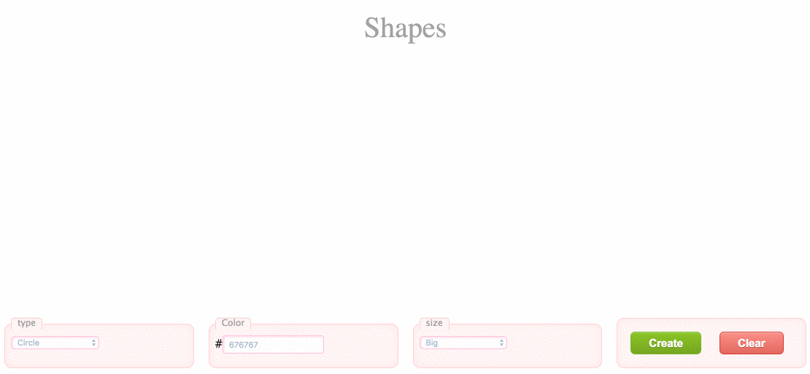

## Create Shape - backbone - Webpack - RESTfull API

This is an example how create shape ( triangle, square, circle ) with RESTful API.


ScreenShot:


///////////////////////////////////////////////////////////////

What do you need to install:

- node

- mondodb

- Install all dependencies: ```npm install```

///////////////////////////////////////////////////////////////

Open 3 terminals:

- Run mongodb with : ```sudo mongod``` ( ```sudo mkdir -p /data/db``` if there is no database file )

- Run node server: ```node server.js```

- Run the webpack dev server: ```npm run dev```

///////////////////////////////////////////////////////////////

The webpack dev server run on http://localhost:8080

RESTful API: http://localhost:3030/api
